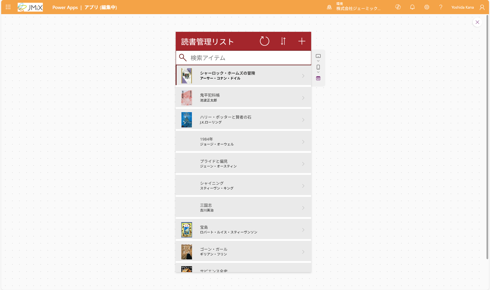
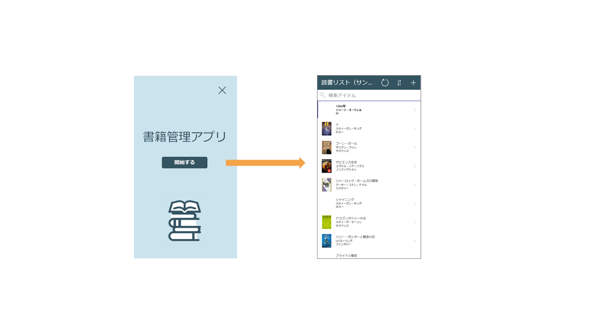
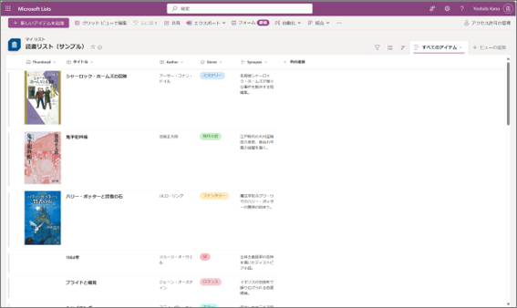
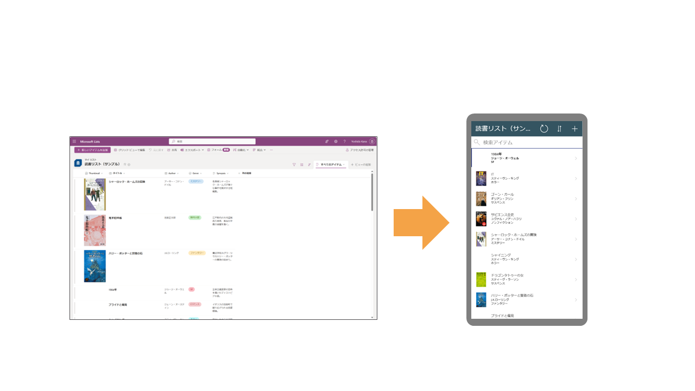

# 今回作成するアプリ
Microsoft Listsで作成したリストの項目をスマホやPCブラウザから簡単に閲覧できるようにするアプリを作成します。

また、トップページも作成します。 
アプリを起動したらまずこの画面が表示され、「開始する」ボタンをクリックするとリストの内容が表示されるようにします。

## 作成手順
1. Listsと組み合わせた管理アプリを作る
2. キャンバスを使って表紙を作る
3. 装飾をする

## 事前準備
事前にMicrosoft Listsでデータソースとなるリストを作成しておいてください。

リストの内容は問いませんが、画像の例のように複数の列を作成しておき、さらに3~5個程度のデータを登録しておくと、アプリの完成形がイメージしやすくなります。
- タイトル
- 作者（テキスト型）
- カテゴリ（選択肢型）
- あらすじ（複数行型）
- サムネイル（画像,添付ファイル型）

また、リストのリンクを利用します。
メモ帳かなにかにコピーしておいてください。

---
[README](./README.md) ⬅️ | [🏠](./README.md) | ➡️ [01-アプリ作成画面を開く](./01-access-powerapps.md)
