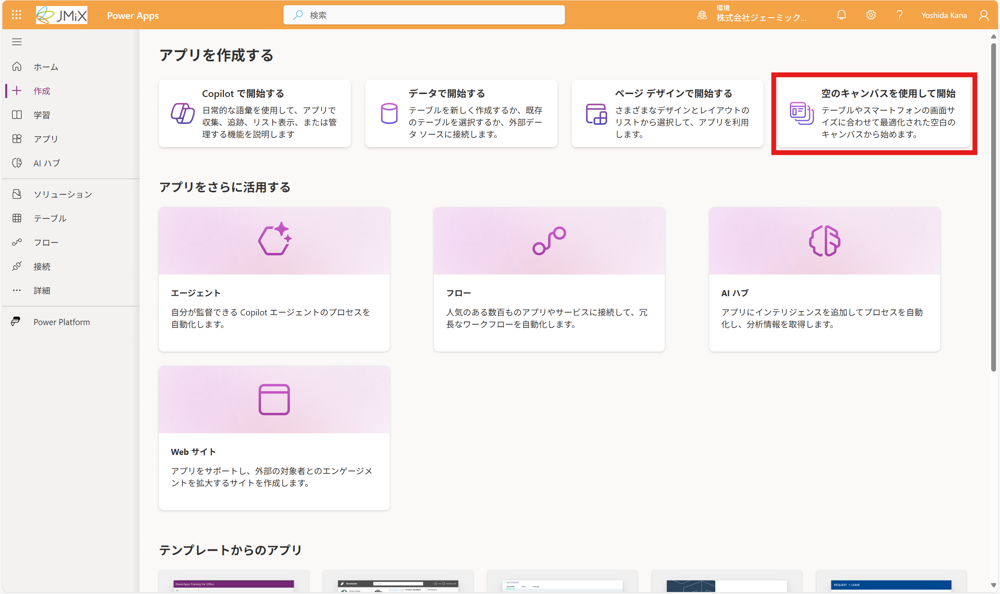
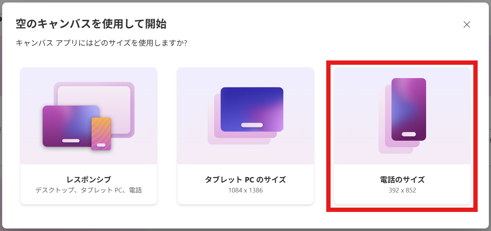
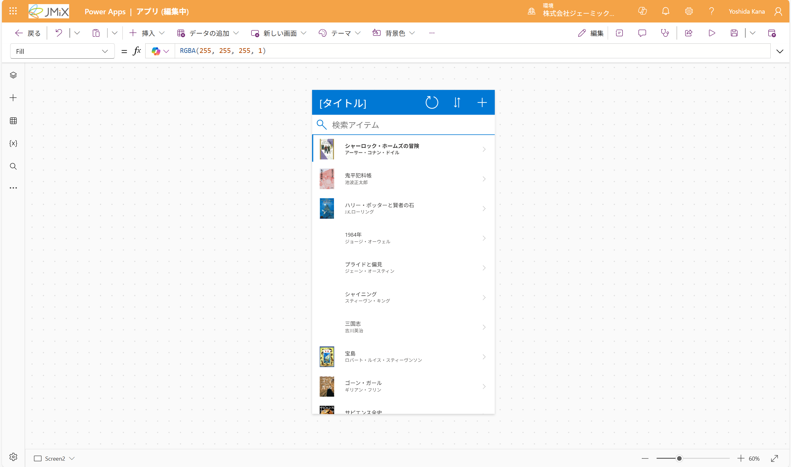

# アプリ作成画面を開く
1. [Power Apps](https://make.powerapps.com/)にアクセスし、必要ならサインインします。 
2. 画面左上の「+作成」をクリックします。
3. 「空のキャンバスを使用して開始」をクリックします。

4. 「電話のサイズ」をクリックします。

5. しばらく待つと、アプリの編集画面に移動します

> [!NOTE]
> ウェルカム画面はスキップします
> 

---
[00-今回作成するアプリ](./00-app-image.md) ⬅️ | [🏠](./README.md) | ➡️ [02-リスト画面を作成する](./02-createlist.md)
