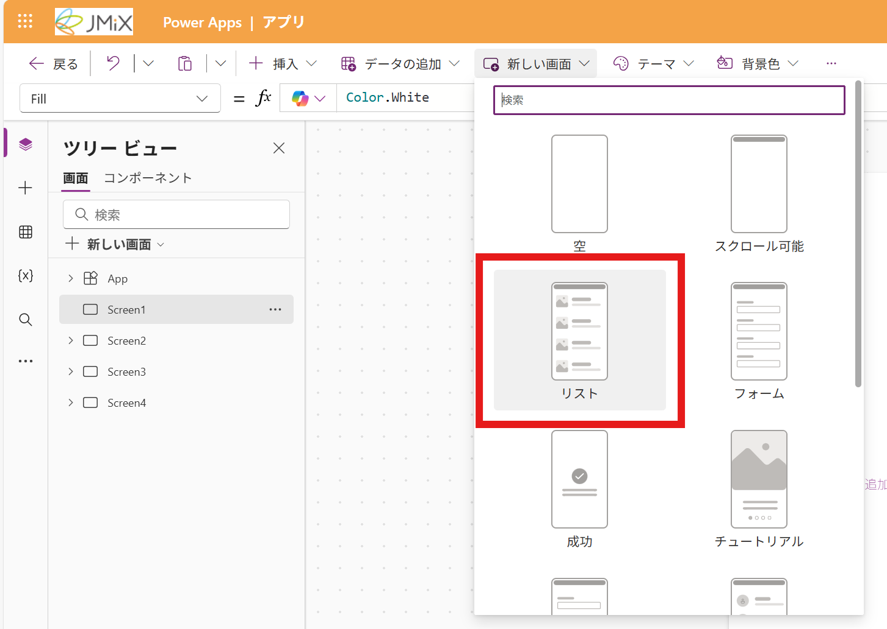
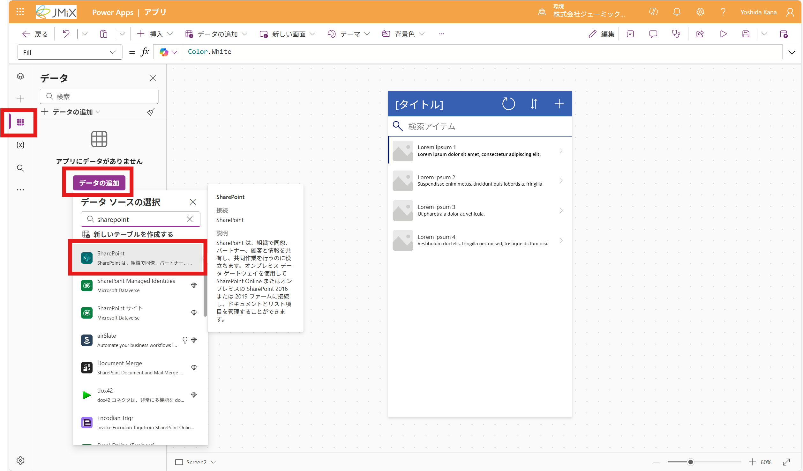
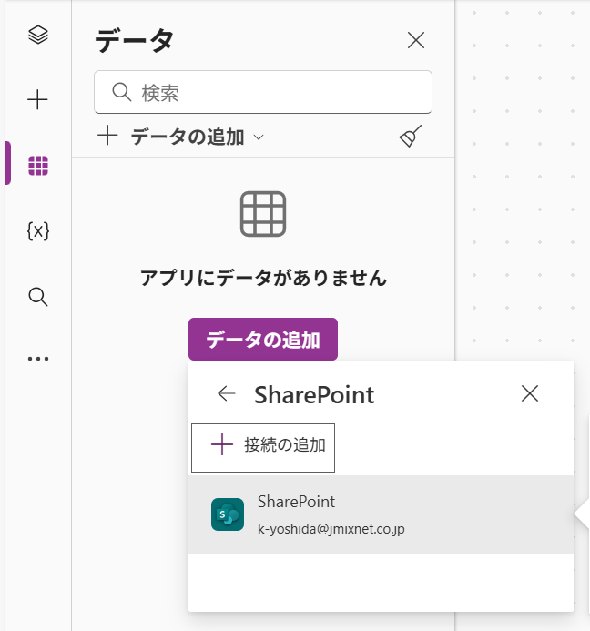
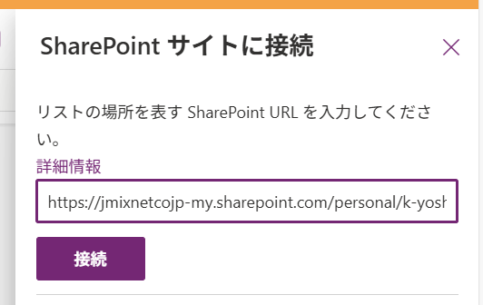
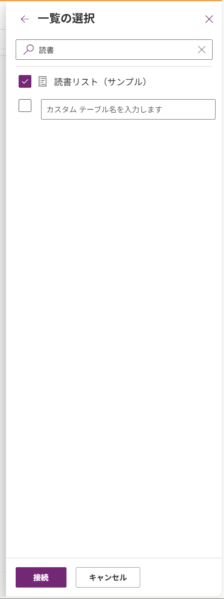
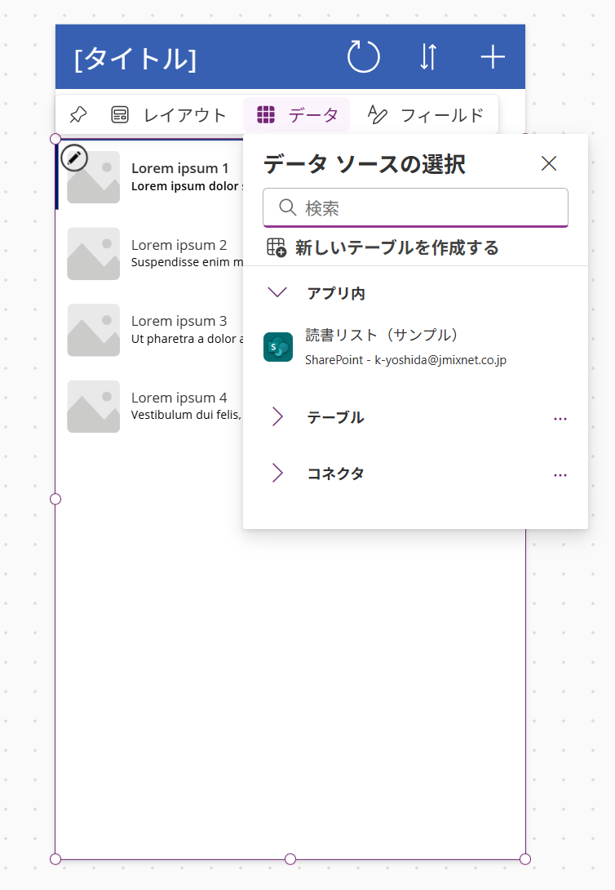
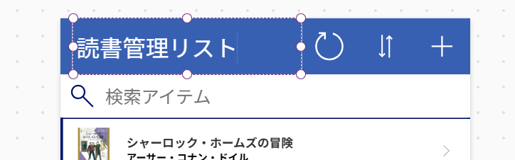
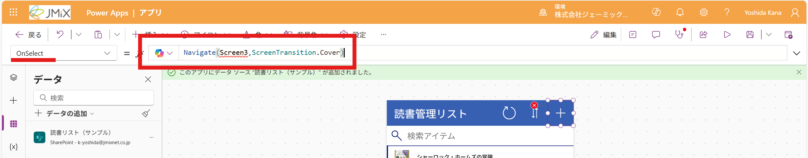
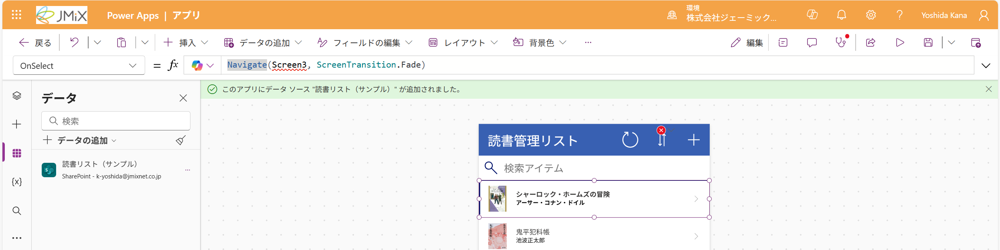
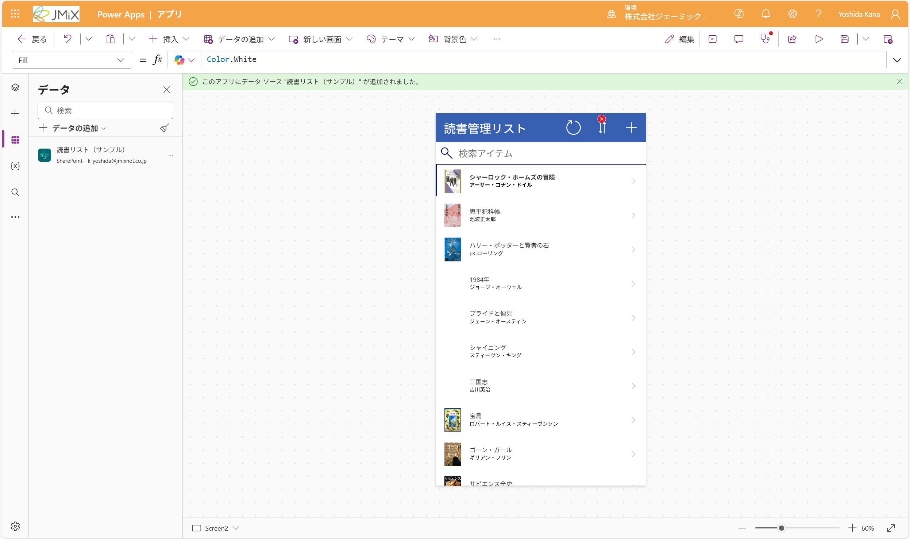

# リスト画面を作成する
まずは、リストを閲覧する画面を作成します

## テンプレートを作る
1. 画面上の「新しい画面」をクリックします。
2. 「リスト」をクリックします。


## データソースを設定する
1. 画面左の「データ」マークをクリックします
2. 「データの追加」をクリックします
3. SharePointを選択します（検索するのがおすすめ）

4. SharePointをクリックします<br>

> [!TIP]
> 次回以降、2~3の手順は省略できます
5. 事前に取得したリストのリンクを入力し、「接続」をクリックします

6. リストを選択し、「接続」をクリックします<br>

7. フォームをクリックし、選択します。
8. 先ほど接続したデータソースをクリックします

9. リストに接続したデータソースが反映されます


## タイトルを編集する
1. [タイトル]をダブルクリックして選択します
2. タイトルを自由に編集します<br>


## 画面遷移を設定する
1. 「+」アイコンをクリックします
2. 画面左上に「OnSelect」が表示されていることを確認し、右側の入力欄に以下のコードを入力します
```PowerApps
Navigate(Screen3, ScreenTransition.Fade)
```


> [!NOTE]
> Navigate関数は、画面遷移を行う関数です。Screen3という名前の画面に遷移するように指定しています。<br>
> また、ScreenTransition.Fadeは、画面遷移時のアニメーションを指定しています。<br>
> Screen3はまだ作成していない画面なので、この時点ではエラーとなりますが、このまま進めてください。<br>

3. リストの一番上の項目を選択します
> [!IMPORTANT]
> 画像のように、項目全体が選択されるようにクリックしてください
> 

4. 2の手順で設定したコードを入力します
```PowerApps
Navigate(Screen3, ScreenTransition.Fade)
```
> [!IMPORTANT]
> 左上が「OnSelect」になっているか確認してから入力してください


## これで、リスト画面の設定は完了です。

---
[01-アプリ作成画面を開く](./01-access-powerapps.md) ⬅️ | [🏠](./README.md) | ➡️ [03-編集画面を追加する](./03-createedit.md)
