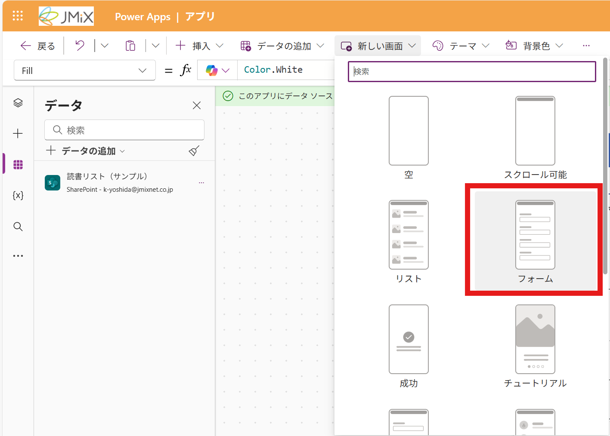

# 編集画面を追加する
リストの項目を追加・編集・削除する画面を追加します。

## 画面を追加する
1. 新しい画面をクリックします
2. 「フォーム」をクリックします

> [!Note]
> ここで、各画面の名称を確認しておくとエラーになりにくくなります。<br>
> 右の「ツリー ビュー」から、先ほどの画面が「Screen2」, 今作成した画面が「Screen3」という名前になっているかを確認してください。
> 

## データソースを設定する
1. 中央の「データに接続してください」をクリックします<br>

2. 先ほどと同様に、SharePointを選択します
3. リストの項目が、フォームに反映されます


## 選択した項目を反映させる
このページは、「02-リスト画面を作成する」で選択した項目を編集する画面です。<br>
そのため、リスト画面で選択した項目が、この画面に反映されるようにします。
1. フォームをクリックして選択します
2. 画面左上を```Item```に変更します

3. 右の入力欄に以下のコードを入力します
```
BrowseGallery1.Selected
```

> [!Note]
> BrowseGallery1は、リスト画面で作成したギャラリーの名前です。<br>
> 上手く値が反映されない場合は、各部の名称に合わせて値を変更してください。<br>

## タイトルを編集する
先ほどと同様に、[タイトル]の部分を自由に編集します

## 画面遷移を設定する
1. xアイコンをクリックします
2. 画面左上に「OnSelect」が表示されていることを確認し、右側の入力欄に以下のコードを入力します
```
Navigate(Screen2, ScreenTransition.Fade)
```
これで、xをクリックするとリスト画面に戻るようになります。


## これで、編集画面の設定は完了です。


---
[02-リスト画面を作成する](./02-createlist.md)⬅️ | [🏠](./README.md) | ➡️ [04-トップページ追加する](./04-createstartpage.md)
