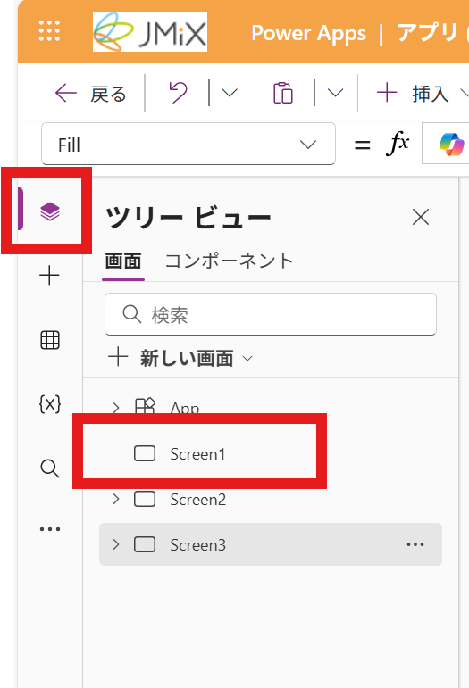
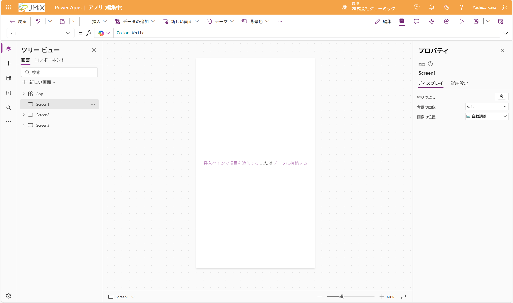
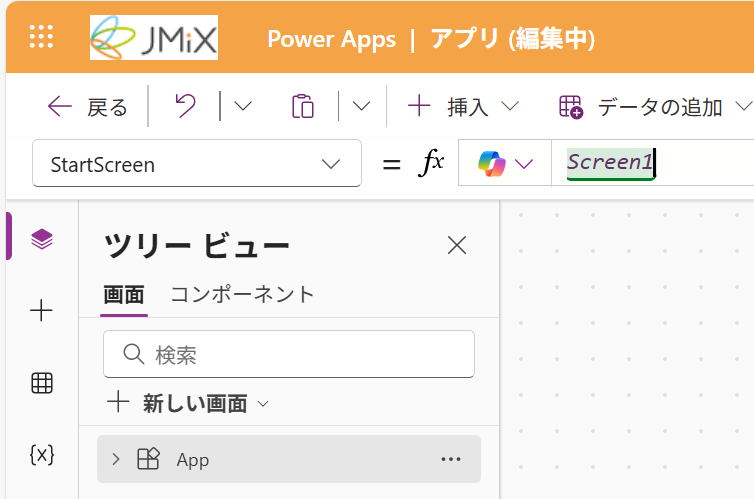
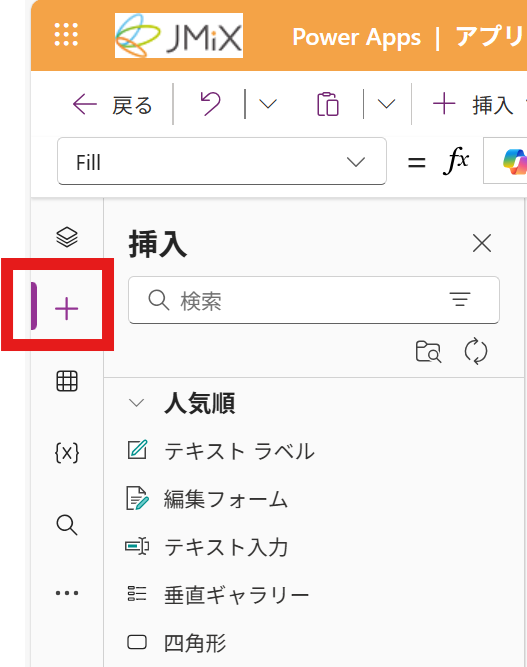
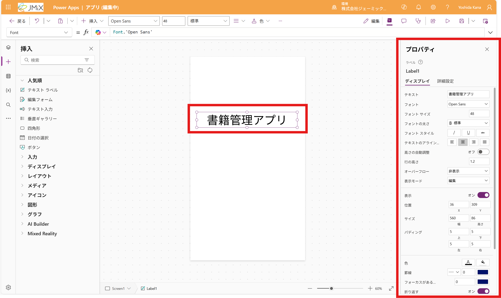
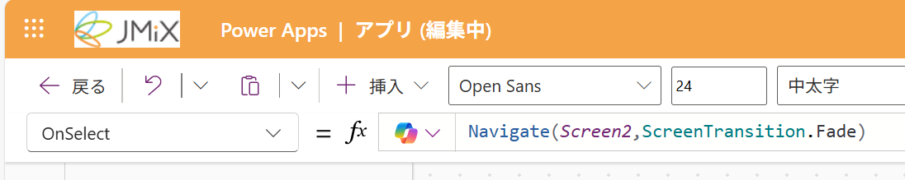

# トップページ追加する
アプリを立ち上げた最初に表示するページを追加します。

## ページに移動する
1. 画面左のサイドバーから「ツリー ビュー」を開き、```Screen1```を選択します

2. 何も追加されていない画面に移動します


## スタート画面に設定する
1. 画面左のツリー ビューから、```App```を選択します
2. 画面左上の「StartScreen」に以下のコードを入力します
```
Screen1
```


## テキストを追加する
1. 画面左のサイドバーから「挿入」を開きます

2. 「テキストラベル」を画面にドラッグし、配置します
3. ラベルをダブルクリックして、テキストを編集します。今回はアプリ（リスト）のタイトルを入力します

> [!TIP]
> 画面右のプロパティから、フォントサイズや色を変更することもできます。

## ボタンを追加する
1. 「挿入」から「ボタン」をドラッグし、画面に配置します
2. ボタンをダブルクリックして、テキストを編集します。今回は「開始する」と入力します
3. 画面左上の「OnSelect」に以下のコードを入力します
```
Navigate(Screen2,ScreenTransition.Fade)
```


## これで、トップページの設定およびアプリの作成は完了です。

> [!NOTE]
> 画像を挿入する方法は、[オプション-デザインを追加する](./op-design.md)を参照してください。

---
[03-編集画面を追加する](./03-createedit.md) ⬅️ | [🏠](./README.md) | ➡️ [05-テスト・公開を行う](./05-test-publish.md)
