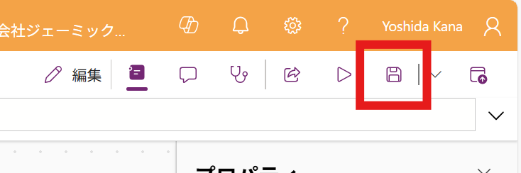
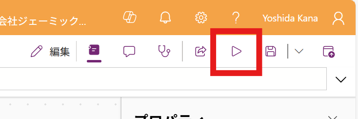
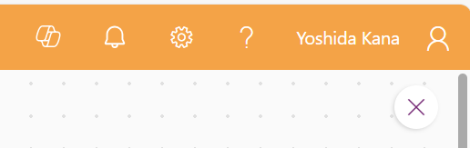
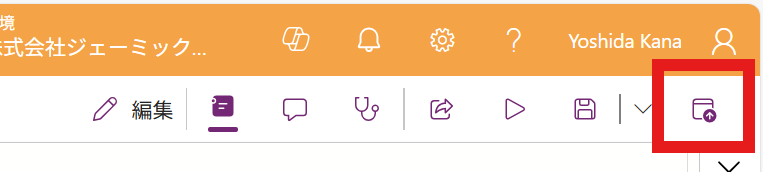
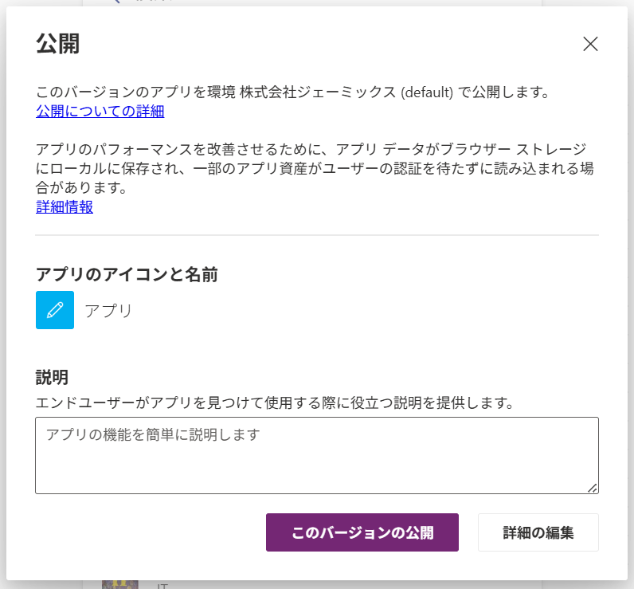
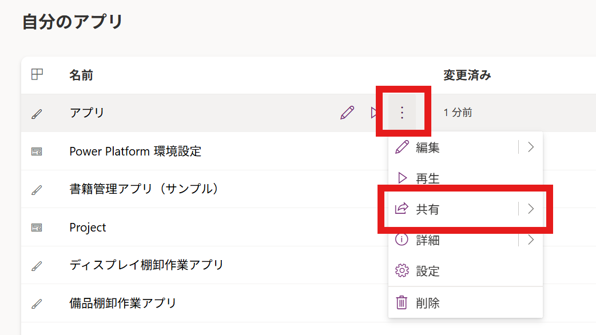
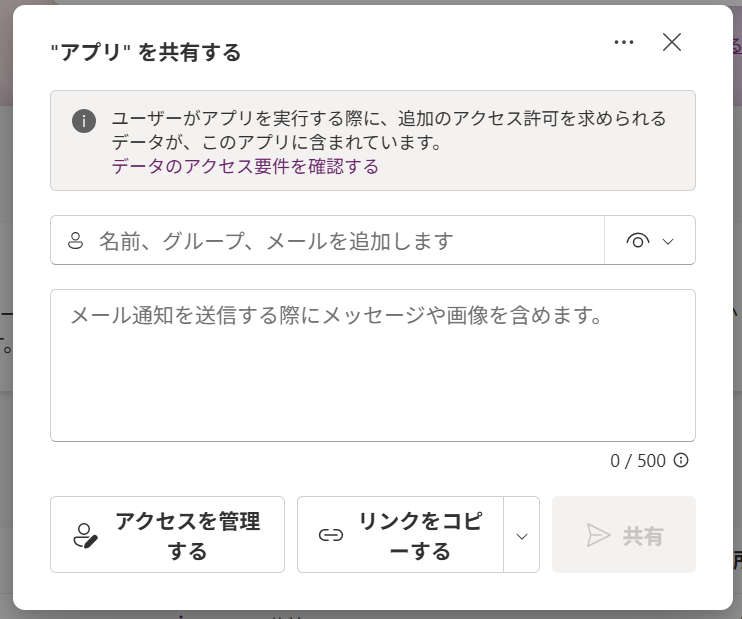

# テスト・公開を行う
## 保存
右上の「保存」ボタンをクリックして、変更を保存します。

> [!NOTE]
> 公開後に保存しても、公開された内容は反映されません。こまめに保存しておくことをおすすめします。
## テスト
実際に運用する前に、動作確認を行います。
1. 事前にScreen1（トップページの画面）に移動しておきます
2. 右上の「アプリのプレビュー」をクリックします

3. 各ボタンが正常に動作するか確認します
### 確認ポイント
#### Screen1（トップページ）
- 「開始する」ボタンをクリックすると、Screen2（リスト）に移動する
#### Screen2（リスト）
- リストの内容が正常に表示されている
- 項目をクリックすると、Screen3（編集画面）に移動する
- 画面右上の「+」ボタンをクリックしても、screen3に移動する
#### Screen3（編集画面）
- screen2で項目を選択して移動したとき、フォームに選択した項目が表示される
- 内容を書き換えて「✓」をクリックすると、リストの項目が反映される
- 「x」ボタンをクリックすると、Screen2に移動する
4. テストが完了したら、右上の「x」ボタンをクリックしてプレビューを終了します

## 公開
テストが完了したら、実際に運用するために公開します。
1. 右上の「公開」ボタンをクリックします

2. 「このバージョンの公開」をクリックします 

> [!IMPORTANT]
> この時点では、作成者以外のユーザーはアプリを使用できません

## 共有
1. Power Appsのホームページに戻ります
2. 「自分のアプリ」から、先ほど作成したアプリを見つけます
3. 「・・・」> 「共有」をクリックします

4. ドキュメント等と同様に共有を行うことができます。 
ユーザーを指定してメール通知ができるほか、URLをコピーして共有することもできます。 

これで、一連の作業は完了です。お疲れ様でした！

---
[04-トップページ追加する](./04-createstartpage.md) ⬅️ | [🏠](./README) | ➡️ [06-まとめ](./06-summary.md)
