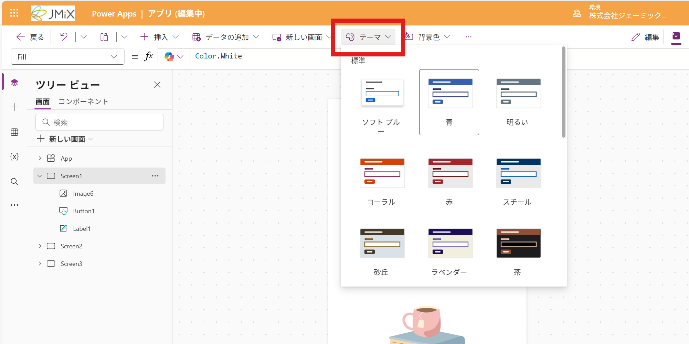
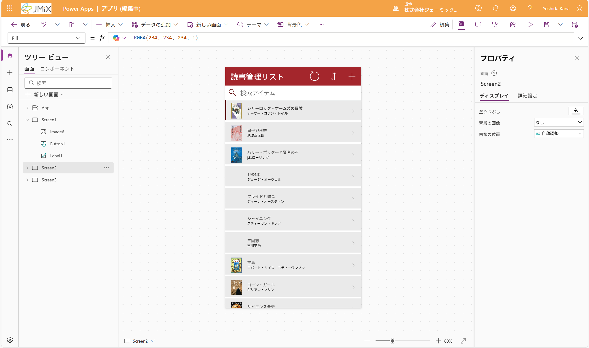
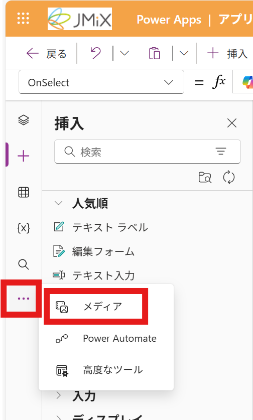
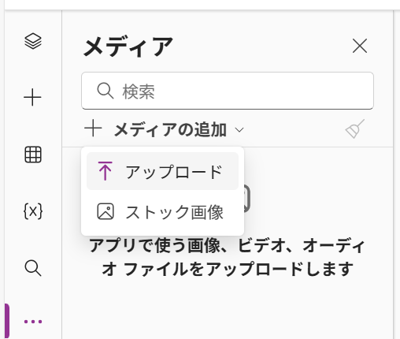
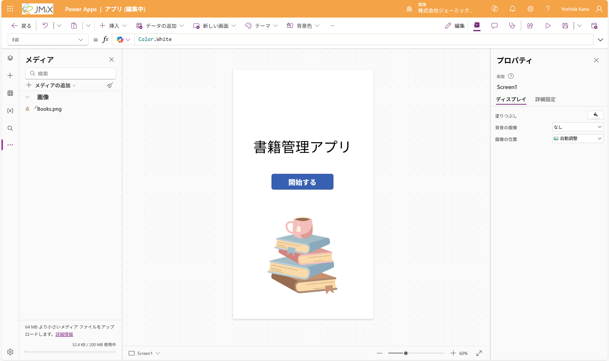

# オプション-デザインを調整する
機能に直接影響はありませんが、時間がある方はデザインの調整にチャレンジしてみましょう！

## カラーを変更する
1. 画面上部の「テーマ」をクリックします

2. 好きなテーマをクリックします
3. アプリ全体のカラーが変更されます

## トップページに画像を追加する
1. 事前に、トップページで使いたい画像を用意しておきます

> [!Note]
> 対応している形式の確認は、こちらを参照してください
> https://learn.microsoft.com/ja-jp/power-apps/maker/canvas-apps/add-images-pictures-audio-video

2. 左のサイドバーから「・・・」>「メディア」をクリックします 

3. 「メディアの追加」> 「アップロード」をクリックします 

4. 画像を選択してアップロードします
5. アップロードした画像を画面にドラッグし、配置します
6. 必要なら、サイズを調整します

---
[06-まとめ](./06-summary.md) ⬅️ | [🏠](./README.md) 
